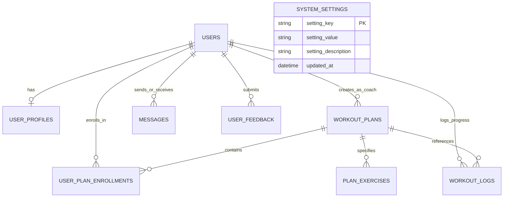

# Online Fitness Coaching Platform 

A comprehensive, production-grade Online Fitness Coaching Platform developed using **Java** and **DBMS SQL (SQLite & MySQL compatible)**.

The platform provides a 3-role portal for **Administrators**, **Fitness Coaches**, and **Trainees/Users**, featuring workout plan management, progress tracking with charts, direct messaging, content moderation, and system settings.

---

## 🚀 Key Highlights & Features

### 1. User Roles & Capabilities
* **👑 Administrator**:
  * **User Management**: Create, view, update, deactivate, and delete user accounts. Filter by role (`ADMIN`, `COACH`, `USER`), status (`ACTIVE`, `INACTIVE`), and search by name/email.
  * **Content Moderation**: Review workout plans created by coaches. Approve or reject with feedback notes before plans become visible to users.
  * **System Settings**: Configure platform name, support email, max users per coach, registration toggle, maintenance mode, currency, and global announcement banners.
  * **Content Overview**: Visual analytics of user role distributions, plan moderation status, daily workout trends, and platform KPIs.
  * **User Feedback**: Review trainee ratings, comments, and resolve feedback tickets.

* **🏋️ Fitness Coach**:
  * **Workout Plan Management**: Create and manage detailed workout programs with day-by-day routines, exercises, sets, reps, duration, and rest intervals.
  * **User Interaction**: Dedicated 2-way messaging portal to chat with trainees, answer questions, and give personalized fitness advice.
  * **Track User Progress**: Monitor enrolled trainees, review their body weight progressions, calorie expenditures, and workout logs.
  * **Plan Analytics**: Engagement charts displaying enrollment counts and completed sessions per workout plan.
  * **Interaction History**: Full searchable audit log of past interactions with trainees.

* **🏃 Trainee / User**:
  * **Access Workout Plans**: Browse approved training plans (Fat Loss, Hypertrophy, HIIT Cardio, Yoga & Mobility), view day-by-day schedules, and enroll in active routines.
  * **Fitness Progress Tracker**: Log daily workout sessions with duration, calories burned, body weight, and workout notes. Visualize body weight trends and calorie burn history via interactive charts.
  * **Interact with Coaches**: Message certified coaches directly for form feedback, routine tweaks, and nutrition encouragement.
  * **Profile Management**: Update personal metrics including age, gender, height, current weight, target goal weight, and fitness bio.
  * **Workout History & Achievements**: Log history table with gamified milestone badges (*First Step*, *Consistency Starter*, *Calorie Crusher*, *Century Hour*).
  * **Platform Feedback**: Submit star ratings and feedback to administrators.

---

## 🛠️ Technology Stack & Architecture

* **Language**: Java (compatible with JDK 17, 21, 25+)
* **Database**: DBMS SQL
  * Primary Engine: **SQLite 3** (`data/fitness.db`) with zero external driver installation required.
  * Enterprise Ready: Complete **MySQL DDL schema** (`sql/mysql_schema.sql`) for MySQL 8+.
* **Web Server**: Built-in High-Performance Java `com.sun.net.httpserver.HttpServer` with multi-threaded executor pool.
* **Frontend**: HTML5, CSS3 (Modern Dark Slate Athletic UI), Vanilla JavaScript with offline SVG/Canvas chart rendering.
* **Architecture Pattern**: Clean MVC / DAO (Data Access Object) layered architecture.

---

## 📁 Project Structure

```text
fitness-platform/
├── run.sh                          # One-click build and start script
├── README.md                       # Complete documentation
├── sql/
│   ├── schema.sql                  # SQLite SQL DDL schema
│   ├── mysql_schema.sql            # MySQL SQL DDL schema
│   └── sample_data.sql             # Seed data with Admin, Coaches, Users, Plans & Logs
├── src/
│   └── com/fitness/
│       ├── Main.java               # Application bootstrap and routing
│       ├── config/
│       │   └── AppConfig.java      # Application configuration and paths
│       ├── db/
│       │   ├── DatabaseManager.java# SQL execution engine and auto-seeding
│       │   └── SqlHelper.java      # Parameterized SQL escaping & query builder
│       ├── model/
│       │   ├── User.java           # User entity
│       │   ├── UserProfile.java    # Trainee physical metrics & goals
│       │   ├── WorkoutPlan.java    # Workout plan program
│       │   ├── PlanExercise.java   # Individual exercise routine details
│       │   ├── WorkoutLog.java     # Progress tracking entry
│       │   ├── Message.java        # Coach <-> Trainee chat message
│       │   ├── Feedback.java       # User feedback & rating
│       │   └── SystemSetting.java  # Platform configuration key-value
│       ├── dao/
│       │   ├── UserDao.java
│       │   ├── WorkoutPlanDao.java
│       │   ├── WorkoutLogDao.java
│       │   ├── MessageDao.java
│       │   ├── FeedbackDao.java
│       │   └── SystemSettingsDao.java
│       ├── controller/
│       │   ├── AuthController.java # Login, register, session verification
│       │   ├── AdminController.java# User management, moderation, settings
│       │   ├── CoachController.java# Plans, trainees, chats, analytics
│       │   ├── UserController.java # Plan browsing, progress logs, profile
│       │   └── StaticFileController.java # Web UI static file server
│       └── util/
│           ├── JsonUtil.java       # Dependency-free JSON parser and serializer
│           └── HttpUtil.java       # HTTP exchange request/response utilities
└── web/
    ├── index.html                  # Single Page Application container
    ├── css/
    │   └── styles.css              # Responsive modern design system
    └── js/
        └── app.js                  # Frontend controller & offline chart visualizer
```

---

## 🏁 Quick Start & Running the Application

### 1. Launch Platform
Simply run the startup script from the project directory:

```bash
./run.sh
```

The script will automatically compile all Java classes, initialize the database with `schema.sql` and `sample_data.sql`, and start the web server on:
👉 **`http://localhost:8080`**

### 2. Deploy on Render (Docker-based)
Render's native environment lacks JDK `javac`. We support 1-click Docker deployment:

1. **Push to GitHub**: Push your changes including `Dockerfile` and `render.yaml`.
2. **On Render Dashboard**:
   - Create a **New Web Service** connected to your GitHub repository.
   - Set **Runtime** to **Docker** (Render will detect the `Dockerfile` automatically).
   - Alternatively, choose **New Blueprint** and select `render.yaml`.
3. Render will build using OpenJDK 21, install SQLite 3, inject the `$PORT` environment variable, and deploy your live URL.

### 3. Demo Credentials

You can use the **Quick Persona Switcher** at the top of the page, or sign in with:

| Role | Name | Email | Password |
| :--- | :--- | :--- | :--- |
| **Admin** | System Administrator | `admin@fitness.com` | `admin123` |
| **Coach** | Marcus Vance (Strength) | `coach.marcus@fitness.com` | `coach123` |
| **Coach** | Elena Rostova (HIIT) | `coach.elena@fitness.com` | `coach123` |
| **User** | John Doe (Fat Loss) | `john.doe@gmail.com` | `user123` |
| **User** | Sarah Connor (Hypertrophy) | `sarah.connor@gmail.com` | `user123` |
| **User** | Alex Smith (Beginner) | `alex.smith@gmail.com` | `user123` |

---

## 🗄️ Database Schema & Entities

The platform uses standard SQL with foreign keys, cascading deletes, and integrity constraints:



### Table Definitions:
1. `users`: Stores user identity, authentication, roles (`ADMIN`, `COACH`, `USER`), status (`ACTIVE`, `INACTIVE`), and bio.
2. `user_profiles`: Stores trainee metrics (age, gender, height, current weight, target weight, fitness goal).
3. `workout_plans`: Stores plans created by coaches, categorized by difficulty and goal, with admin approval status (`PENDING`, `APPROVED`, `REJECTED`).
4. `plan_exercises`: Daily routines with exercise name, sets, reps, duration, and rest intervals.
5. `user_plan_enrollments`: Tracks which plans trainees are actively following.
6. `workout_logs`: Recorded sessions with date, duration, calories burned, body weight, and workout notes.
7. `messages`: Direct communication between coaches and trainees with read receipt status.
8. `user_feedback`: User ratings (1-5 stars) and platform feedback reviewed by admin.
9. `system_settings`: Platform-wide configurations and global announcement banners.
